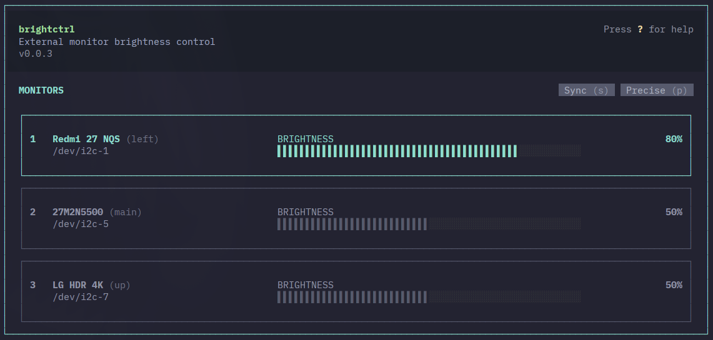

# BrightCtrl

Adjust brightness of your monitors right from the terminal.



## Install

### Arch Linux (AUR)

```bash
yay -S brightctrl
```

### npm

```bash
npm install -g brightctrl
```

Or run without installing:

```bash
npx brightctrl
```

## Getting Started

1. Install `ddcutil`:

   - **Arch / Manjaro:** `sudo pacman -S ddcutil`
   - **Debian / Ubuntu:** `sudo apt install ddcutil`
   - **Fedora:** `sudo dnf install ddcutil`

2. Add yourself to the `i2c` group and load the kernel module:

   ```bash
   sudo usermod -aG i2c $USER
   sudo modprobe i2c-dev
   ```

3. **Log out and back in** (or restart).

4. Run `brightctrl` and adjust away.

## Controls

| Key | Action |
|---|---|
| `↑` `↓` | Pick a monitor |
| `←` `→` | Turn brightness down/up |
| `s` | Sync — adjust all monitors at once |
| `r` | Refresh monitor list |
| `q` | Quit |

Toggle **precise mode** with `p` for 1% steps instead of 5%.

Brightness changes are saved automatically and restored on next launch.
